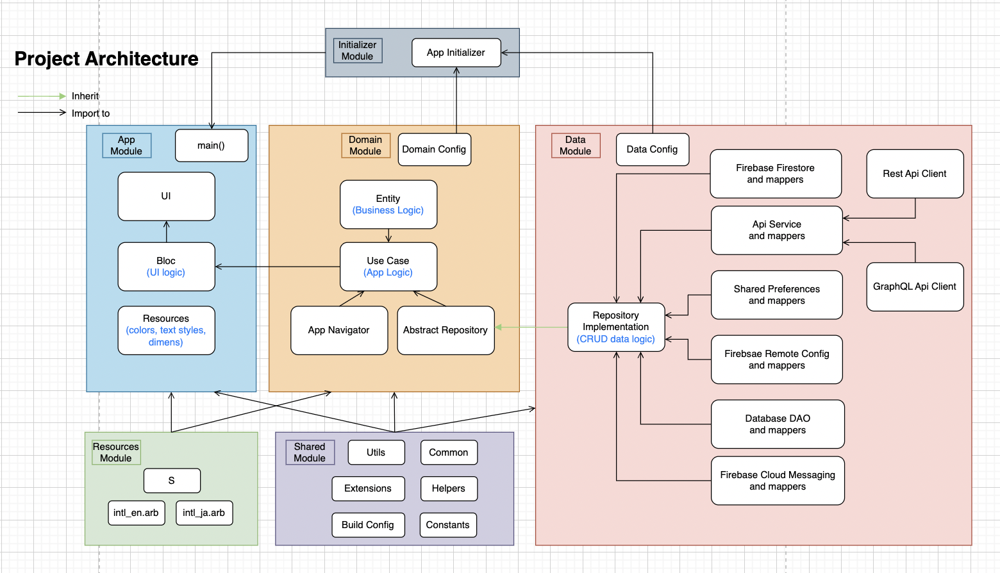

[<- Trở về](../README.md#architecture)

# Kiến trúc



# Cấu trúc thư mục

Chúng ta có tất cả 6 module (package)

* App
* Domain
* Data
* Resources
* Shared
* Initializer

## Module App
Chúng ta sẽ code UI và Bloc trong module này. Đây cũng là nơi được khai báo hàm main() là entry point để run app của chúng ta.

Hai folder app_icon và splash chứa hai file app-icon.yaml và splash.yaml để chúng ta config app icon và màn hình splash của project theo hướng dẫn của thư viện flutter_launcher_icons và flutter_native_splash.

```
├── android
├── ios
├── web
├── app_icon
├── splash
├── lib # Main directory
│   ├── app 
│   │   ├── app # MaterialApp
│   │   ├── bloc # Bloc dùng cho toàn bộ App có các thuộc tính trạng thái như đổi ngôn ngữ,..
│   ├── base # Code các base class: BasePageState, BaseBloc
│   ├── config # config khởi tạo application
│   ├── di #  Setup DI cho module app
│   ├── navigation # Khai báo các màn hình và các dialog, bottom sheet được sử dụng trong module app.
│   ├── resource # Khai báo các resources để code UI: Colors, Dimens, generated
│   ├── ui #  UI và Bloc cho từng màn hình.
│   └── main.dart # main file
├── analysis_options.yaml # lint rules
└── pubspec.yaml # pubspec file
```
### 1. Folder `android`

    Nơi chứa các config để build android

### 2. Folder `ios`

    Nơi chứa các config để build ios

### 3. Folder `web`

    Nơi chứa các config để build web

### 4. Folder `app_icon`

    Nơi chứa file `app-icon.yaml` để chúng ta config app icon theo hướng dẫn của thư viện [flutter_launcher_icons](https://pub.dev/packages/flutter_launcher_icons)

### 5. Folder `splash`

    Nơi chứa file `splash.yaml` để chúng ta config app icon theo hướng dẫn của thư viện [flutter_native_splash](https://pub.dev/packages/flutter_native_splash)

### 6. Folder `lib`

#### 6.1. Folder `app` 
#### 6.2. Folder `base` 
#### 6.3. Folder `config` 
#### 6.4. Folder `di` 
#### 6.5. Folder `exception_hanler` 
#### 6.6. Folder `navigation` 
#### 6.7. Folder `ui` 
#### 6.8. File `app.dart` 
#### 6.9. File `main.dart` 

### 7. File `analysis_options`
### 8. File `pubspec`

## Module Domain

```
lib ├── src
    │   ├── config
    │   ├── di
    │   ├── models
    │   ├── repositories
    │   ├── usecase
    └── domain.dart
```

## Module Data
## Module Shared
## Module Initializer
## Các folder và file khác